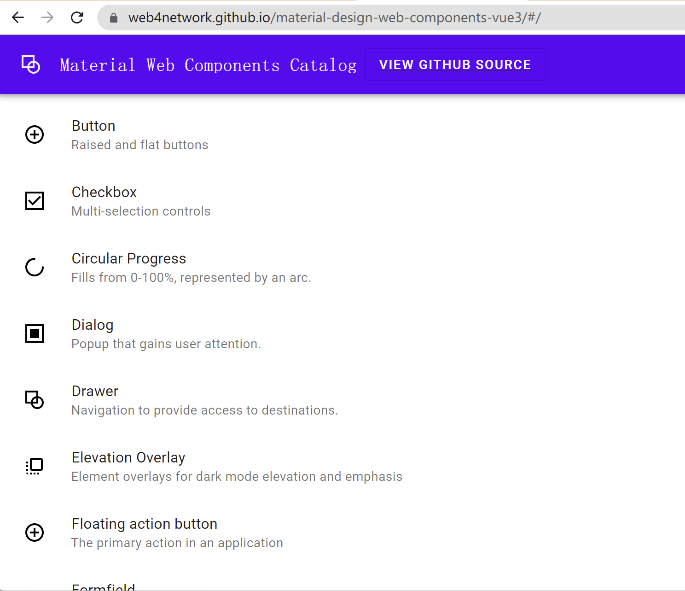
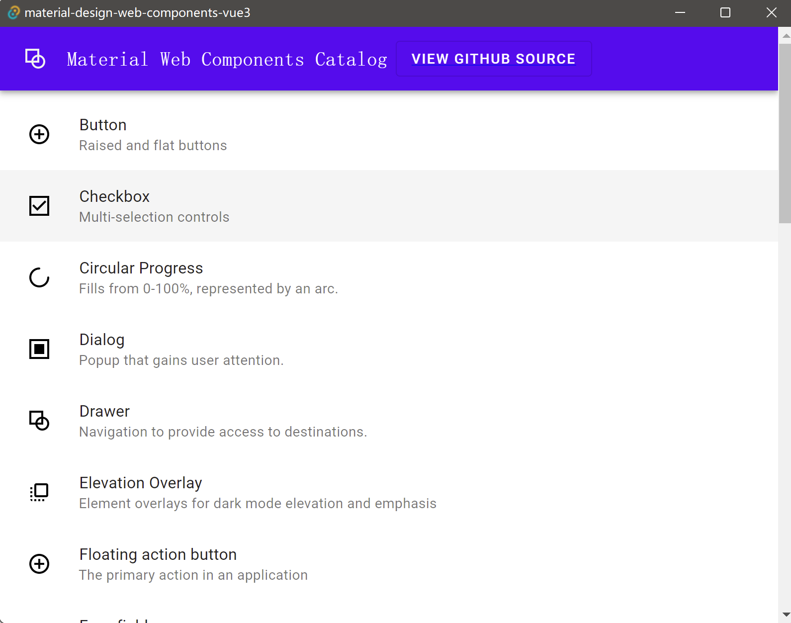

# Material Design Web Components Demos Vue3

## 技术栈

* Vue 3 + Vite
* Material Design Web Components
* JavaScript
* Tauri （替代 Electron ）

### 相关截图

* 网站截图



* 桌面端程序截图



### 资源链接

https://github.com/material-components/material-web

https://material-components.github.io/material-web

### 说明

本代码库是参考源码：

https://github.com/material-components/material-web/tree/master/demos

将 Material Design Web Components 的 demos 改写为使用 Vue 3 + Vite ，可以支持使用 Tauri 打包为桌面端程序

### 相关命令

* 启动网站

```shell
  yarn install
  yarn start
```

* 打包网站

```shell
yarn build
```

* 初始化Tauri配置

```shell
yarn tauri init
```

* 启动Tauri App

```shell
yarn tauri dev
```

* 打包Tauri App

```shell
yarn tauri build
```